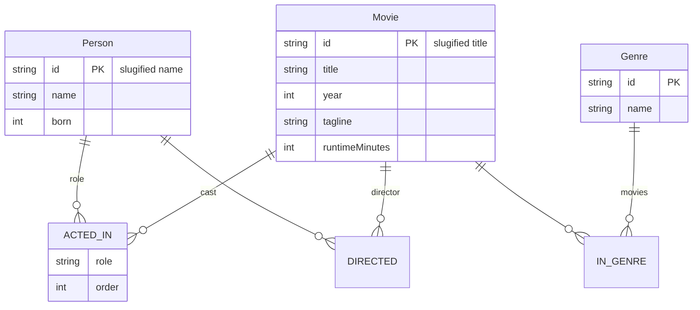

# CineGraph 🎬

**CineGraph** is a graph-powered movie discovery app. Every movie, actor, director and genre is a *node*; every credit is a *relationship*. The whole application is backed by a real graph database — **CognoDB** — queried live over the Bolt protocol with parameterized openCypher.

> Built for the Wexa AI take-home assignment: *Build a Graph Database Application using CognoDB.*

Live demo: *(add Vercel URL here)*
Screen recording: *(add Loom/Drive link here)*

---

## Why a graph database? Why CognoDB?

Movie data is *connection-shaped*: an actor appears in a film, a director directs a film, films share genres. The questions that make movie apps magical are traversal questions:

- "How is Keanu Reeves connected to Tom Hanks?" — a **shortest-path** query over variable-length paths
- "Who have this film's cast worked with?" — a **neighbourhood expansion**
- "You might also like" — a **two-hop recommendation** through shared actors/genres

In SQL these require recursive CTEs, bridge tables, or N-way joins of `film_cast` rows — and the query length grows with the hop count. A graph database models the domain 1:1:

```cypher
MATCH p = shortestPath((a:Person {id: $from})-[*..4]-(b:Person {id: $to}))
RETURN p
```

Six hops of SQL pain become one line of Cypher. **CognoDB** speaks this language natively (openCypher over Bolt 5.x, official Neo4j drivers), it's free at the `c0` tier, and it is delightfully simple to provision — no cluster, no YAML.

---

## Data model



Seed data: **30 films**, **~100 people**, **12 genres** — curated so that interesting paths exist. Try the flagship demo: **Keanu Reeves → Tom Hanks** (4 steps / 8 hops through *The Matrix → Contagion → Inception → Catch Me If You Can*).

---

## Tech stack

| Layer    | Choice                                  |
| -------- | --------------------------------------- |
| App      | Next.js 16 (App Router) + TypeScript    |
| Database | CognoDB (c0 free tier, openCypher/Bolt) |
| Driver   | `neo4j-driver` 6.x (official)           |
| UI       | Tailwind CSS v4, hand-rolled SVG graph  |
| Hosting  | Vercel (free)                           |

---

## Getting started

### 1. Provision CognoDB

1. Sign up at <https://console.cognodb.com/signup> (free, no credit card).
2. Create an instance (the free **c0** tier is enough — 256 MB RAM / 1 GB disk).
3. Open the **Overview** tab and copy your connection details:
   - **URI** — looks like `bolt+s://<name>.cognodb.com:7687` (or similar; the console shows it)
   - **Username** — usually `cognodb`
   - **Password** — shown when the instance is created
4. Keep the instance running while you develop — CognoDB instances may sleep when idle and wake on connection.

### 2. Configure the app

```bash
git clone <your-repo-url>
cd cinegraph
npm install
```

```bash
cp .env.example .env
```

Fill in `.env` — **use the `bolt+ssc://` scheme**. CognoDB issues its own CA certificates, so the default `bolt+s://` (public-CA validation) fails with `ECONNRESET`; `bolt+ssc` trusts the endpoint certificate on first use:

```dotenv
NEO4J_URI=bolt+ssc://your-instance-id.databases.cognodb.com
NEO4J_USER=cognodb
NEO4J_PASSWORD=your-instance-password
```

### 3. Seed the graph

```bash
npm run seed
```

The seed script is **idempotent** — it uses `MERGE` and can be re-run safely. It reports the node/relationship counts when done.

### 4. Run it

```bash
npm run dev        # http://localhost:3000
```

The footer status pill turns **green** when the app can reach CognoDB, red when it cannot (the app degrades gracefully either way).

---

## What the app demonstrates

| Feature | Underlying query |
| --- | --- |
| Movie search (home) | `MATCH (m:Movie) WHERE m.title CONTAINS $q` — parameterized, index-backed |
| Browse + graph stats | `MATCH (m:Movie)-[:IN_GENRE]->(g:Genre)` counting nodes/relationships |
| Movie page — cast, director, genre | `MATCH (m:Movie {id: $id})-[:ACTED_IN]-(p)` pattern-match |
| "You might also like" | **2-hop traversal**: `(m)-[:ACTED_IN|IN_GENRE*2]-(other)` — no SQL equivalent |
| Person page — filmography | `MATCH (p:Person {id: $id})-[:ACTED_IN]->(m)` |
| Most frequent co-stars | `(p)--(m)--(coStar)` counted & ranked — 2 hops |
| **Connection explorer** | **Variable-length shortest path**: `shortestPath((a)-[*1..$maxHops]-(b))` — the SQL-awkward query |
| Cast network graph | Neighbourhood expansion 2 layers deep, rendered as interactive SVG |

Every query is **parameterized** (no string interpolation of user input) and all Cypher lives in one module: `src/lib/queries.ts`.

### The flagship query

```cypher
MATCH (a:Person {id: $from}), (b:Person {id: $to})
MATCH p = shortestPath((a)-[*1..$maxHops]-(b))
RETURN p
```

CognoDB's `shortestPath` explores the graph bidirectionally and returns the shortest connection — often a "6 degrees of Kevin Bacon" answer in milliseconds. The UI renders the path as an interactive graph and a step-by-step narrative.

---

## How it works — a simple example

Think of the data as one giant web of **who worked with whom**. Three everyday situations:

**1. You're on an actor's page → they suggest movies**
If **Keanu Reeves** acted in *The Matrix*, the person page shows *The Matrix* in his filmography, and every other movie that shares at least one cast member or genre appears below as a recommendation — ranked by how much overlap they share.

```
Keanu Reeves
  ├─ The Matrix         (his movie)
  ├─ John Wick          (recommended — shares Keanu)
  ├─ Speed              (recommended — shares Keanu)
  └─ The Devil's Advocate (recommended — shares Keanu)
```

**2. Two people are in the SAME movie → instant connection**
If you pick **Keanu Reeves** and **Laurence Fishburne** in the Connection Explorer, the app finds they starred together in *The Matrix* — a direct **1-hop path**, shown immediately:

```
Keanu Reeves ──(The Matrix)── Laurence Fishburne      (1 hop, done!)
```

**3. Two people are in DIFFERENT movies → the graph walks the chain**
Keanu Reeves and Tom Hanks have never shared a film, so the app hops through co-stars until they meet — *The Matrix → Contagion → Inception → Catch Me If You Can* (8 hops, 4 steps). This is the "6 degrees of separation" search:

```
Keanu Reeves → The Matrix → Laurence Fishburne → Contagion → Marion Cotillard
    → Inception → Leonardo DiCaprio → Catch Me If You Can → Tom Hanks
```

Every recommendation and every path is computed **live** by walking relationships in the graph database — no precomputed tables.

---

## Project structure

```
cinegraph/
├── scripts/
│   ├── seed-data.ts      # curated dataset (30 films, ~100 people)
│   └── seed.ts           # idempotent MERGE-based seeder (npm run seed)
├── src/
│   ├── app/
│   │   ├── api/          # route handlers (all force-dynamic)
│   │   │   ├── movies/   # GET /api/movies?q=…
│   │   │   ├── browse/   # GET /api/browse
│   │   │   ├── movie/[id]/
│   │   │   ├── people/   # GET /api/people?q=…
│   │   │   ├── person/[id]/
│   │   │   ├── connect/  # GET /api/connect?from=&to=&kind=&maxHops=
│   │   │   └── health/
│   │   ├── movie/[id]/   # film page: cast, recommendations, cast network
│   │   ├── person/[id]/  # filmography, co-stars, connect CTA
│   │   └── connect/      # connection explorer (flagship)
│   ├── components/       # UI + interactive SVG GraphView, pickers…
│   └── lib/
│       ├── types.ts      # shared types
│       ├── neo4j.ts      # driver singleton, error taxonomy, connectivity check
│       ├── queries.ts    # ALL Cypher (parameterized)
│       └── api.ts        # error envelope helpers
├── docs/                 # PRD + implementation plan (also in repo root)
└── .env.example
```

---

## Graceful degradation

- If CognoDB is unreachable, API routes return a typed error envelope `{ error: { code, message } }` (`db_unavailable` → 503) and every page renders a friendly retry state — **no crashes, no white screens**.
- Driver connection pooling (max 10) with acquisition + connection timeouts so the app never hangs.
- Empty states everywhere: unseeded DB, no search results, no path within N hops ("that's a real graph answer too").

---

## Deployment (Vercel)

1. Push the repo to GitHub.
2. Import the repo in Vercel (framework auto-detected: Next.js).
3. Add the same three env vars (`NEO4J_URI`, `NEO4J_USER`, `NEO4J_PASSWORD`) under **Project → Settings → Environment Variables**.
4. Deploy. That's it — the API routes are serverless and the driver pools connections per instance.
5. (Optional) Set a custom domain.

> Note: the free c0 instance sleeps when idle; the first request after a pause may take a few seconds to wake up. The app handles this with a clear loading state.

---

## Development scripts

```bash
npm run dev        # dev server
npm run seed       # seed/refresh the graph (idempotent)
npm run lint       # eslint
npm run typecheck  # tsc --noEmit
npm run build      # production build
```

---

## Screenshots

*(replace with your own)*

| Home / search | Connection path |
| --- | --- |
| `screenshots/home.png` | `screenshots/path.png` |

---

## Assignment requirements checklist

- [x] Real graph database app on CognoDB (openCypher over Bolt, official driver)
- [x] All Cypher parameterized
- [x] At least one multi-hop (2+) query — *recommendations, co-stars, shortest path*
- [x] At least one SQL-awkward query — *`shortestPath` variable-length traversal*
- [x] Realistic seed dataset, idempotent seeding
- [x] README: use case, why-graph, data model, setup, queries
- [x] Hosted demo URL + screen recording